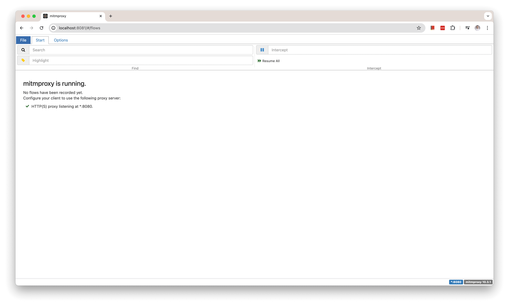
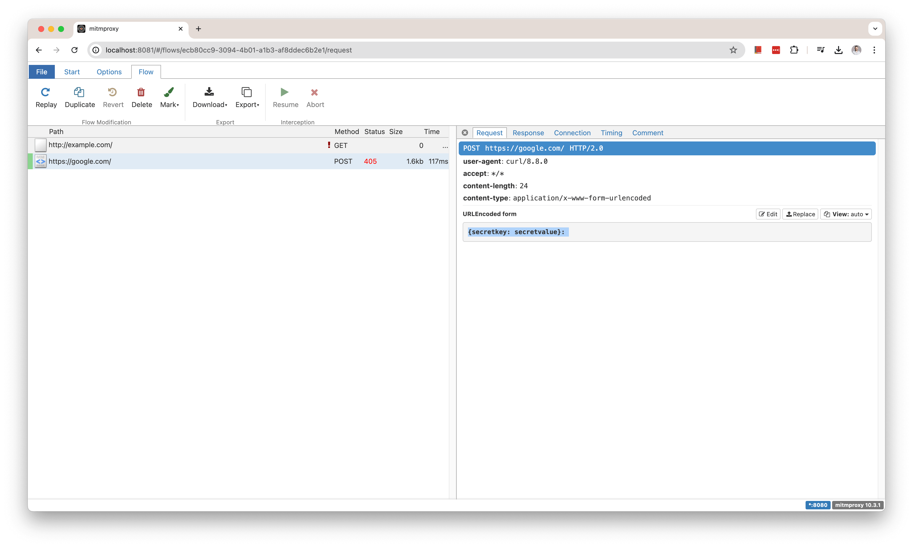
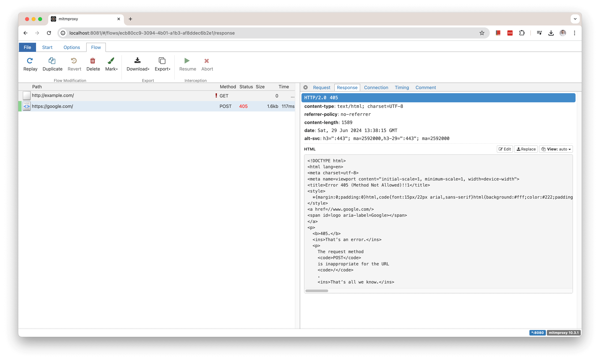

# k8s-sniff-https
A simple [mitmproxy](https://mitmproxy.org/) blueprint to intercept HTTPS traffic from app running on Kubernetes.

**Use case**:
Sometimes you have your own app or a 3rd party app that performs HTTPS calls to remote SaaS backends.
If you are curious like myself and you want to reverse engineer the API calls under the hood, or you want to debug/troubleshoot the traffic when shit hits the fan - you're in the right place!

**But this is an already solved problem!**
That is absolutely correct. So while there are other tools that intercept traffic originating from the Kubernetes cluster like [Kubeshark](https://www.kubeshark.co/), [tshark](https://www.wireshark.org/docs/man-pages/tshark.html) and even good-ol' [tcpdump](https://www.tcpdump.org/), when TLS traffic is involved you need a [Man-In-The-Middle](https://docs.mitmproxy.org/stable/concepts-howmitmproxyworks/#the-mitm-in-mitmproxy) proxy and you need to distribute the CA bundle to the workloads (Pods running in your cluster).
I found the mitmproxy the most accessible and easy-to-setup-tool out there.

# Related projects
* [HTTP CONNECT forward proxy](https://github.com/ofirc/k8s-http-proxy) - useful for a simple HTTP(s) proxy that does not apply deep packet inspection

* [mTLS Proxy with client credentials](https://github.com/ofirc/go-mtls-proxy) - useful in zero-trust settings

# Overview
## Prerequisites
**Step 0: clone this repository**
```sh
git clone https://github.com/ofirc/k8s-sniff-https/
cd k8s-sniff-https
```

**Step 1: deploy the mitmweb deployment**

Run the following commands:
```sh
kubectl apply -f deploy/mitmweb-deploy.yaml
kubectl apply -f deploy/mitmweb-service.yaml
```

**Step 2: pull the CA bundle from the mitmweb Pod**
```sh
kubectl wait --for=condition=Available deployment/mitmweb --timeout=150s
kubectl wait --for=condition=Ready pod -l app=mitmweb --timeout=150s
# Wait until the file is present inside the selected Pod
POD_NAME=$(kubectl get pod -l app=mitmweb -o=name | cut -d'/' -f2)
CA_BUNDLE=/root/.mitmproxy/mitmproxy-ca-cert.pem
until kubectl exec "$POD_NAME" -- test -f "$CA_BUNDLE"; do
  echo "Waiting for $CA_BUNDLE to appear in $POD_NAME..."
  sleep 2
done
kubectl cp $POD_NAME:$CA_BUNDLE mitmproxy-ca-cert.pem
```

**Step 3: spin up an ephemeral Pod for experimenting**
```sh
kubectl run curl --image=curlimages/curl -- sleep infinity
kubectl wait --for=condition=Ready pod/curl --timeout=150s
```

**Step 4: verify the running Pods**

If all went well, this is what you should see:
```sh
$ kubectl get pod,svc
NAME                          READY   STATUS    RESTARTS   AGE
pod/curl                      1/1     Running   0          18s
pod/mitmweb-978d5b977-nrkxs   1/1     Running   0          9m2s

NAME                 TYPE        CLUSTER-IP      EXTERNAL-IP   PORT(S)             AGE
service/kubernetes   ClusterIP   10.96.0.1       <none>        443/TCP             18d
service/mitmweb      ClusterIP   10.98.161.180   <none>        8080/TCP,8081/TCP   8m11s
$
```

**Step 5: distribute the CA bundle to your workload (Pod)**
```sh
kubectl cp mitmproxy-ca-cert.pem curl:/home/curl_user/mitmproxy-ca-cert.pem
```

**Step 6: access the mitmweb UI console**

We need to ensure we can access the mitmweb (the Web UI / console for mitmproxy) on our browser.

Let's port forward the UI port to our localhost:
```sh
kubectl port-forward svc/mitmweb 8081:8081
```

and open a browser tab to http://localhost:8081.

If all went well then it should look like the following: 


## Sniff HTTP/HTTPS traffic
Execute into the ephemeral curl Pod:
```sh
kubectl exec -it curl -- sh
```

Trigger an HTTP request:
```sh
curl -x http://mitmweb:8080 -v http://example.com
```

Then trigger an HTTPS request:
```sh
curl --cacert mitmproxy-ca-cert.pem  -x http://mitmweb:8080 -v https://google.com -d '{secretkey: secretvalue}'
```

If all went well then it should look like the following for all flows: 

Then we click on the HTTPS egress flow, we can inspect the request headers and body: 

as well as the response headers and body: 

## Cleanup
```sh
kubectl delete -f deploy/mitmweb-deploy.yaml
kubectl delete -f deploy/mitmweb-service.yaml
kubectl delete pod curl --force
```

# Frequently Asked Questions (FAQ)

### Question: What resources are deployed to my cluster?
- A Kubernetes Deployment of `mitmweb` with one replica
- A Kubernetes Service called `mitmweb`
- An ephemeral Pod running the `curlimages/curl` image, used for testing

### Question: What ports are used by this deployment?
- Port 8080 for the mitmweb proxy port
- Port 8081 for the mitmweb web interface port
